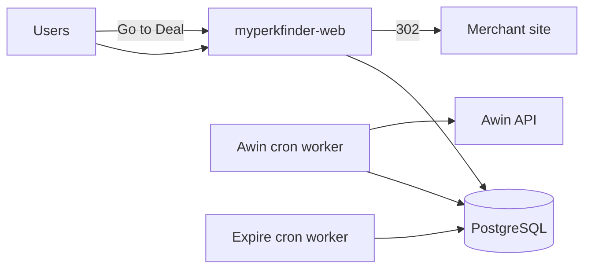

# MyPerkFinder

Scalable deal discovery platform — product offers, coupons, affiliate imports, and admin review.

**Production deployment:** [Railway](https://railway.com) (cost-optimized: one web service + cron workers + Postgres).

## Stack

| Concern    | Technology                                      |
| ---------- | ----------------------------------------------- |
| Monorepo   | Turborepo + pnpm workspaces                     |
| Web (prod) | Next.js 15 — public site, admin, API routes     |
| Database   | PostgreSQL + Prisma                             |
| Imports    | Railway cron workers (`@mpf/worker` CLI)        |
| Search     | PostgreSQL `ILIKE` (no Meilisearch in prod MVP) |

Legacy apps (`apps/api`, `apps/admin`, BullMQ worker) remain for local full-stack dev but are **not deployed** to Railway.

## Layout

```
apps/
  web/       ← Railway: myperkfinder-web (public + admin + /api/*)
  worker/    ← Railway cron CLIs (import + expire)
  api/       ← Local dev only (Fastify)
  admin/     ← Local dev only (superseded by web /admin)
packages/
  affiliate/ validators/ db/ types/ ui/ env/ config/
docs/deployment/
  railway-checklist.md
```

---

## Local development

### Prerequisites

- Node.js 24+ (see `engines` in root `package.json`)
- pnpm 11+ (see `packageManager` in root `package.json`)
- Docker (for local Postgres)

### Setup

```bash
pnpm install
cp .env.example .env
pnpm infra:up          # Postgres (+ optional Redis/Meili for legacy dev)
pnpm db:generate
pnpm db:migrate
pnpm db:seed           # optional sample data
pnpm dev               # Next.js web on :3000
```

| URL              | Description                          |
| ---------------- | ------------------------------------ |
| http://localhost:3000      | Public site                |
| http://localhost:3000/admin | Admin dashboard           |
| http://localhost:3000/api/health | Health check          |

### Commands

| Command | Description |
| ------- | ----------- |
| `pnpm dev` | Start web app |
| `pnpm dev:all` | Start all turbo apps (legacy api/admin/worker) |
| `pnpm build` / `pnpm build:web` | Production build |
| `pnpm start:web` | Start production web server |
| `pnpm db:migrate` | Dev migrations |
| `pnpm db:migrate:deploy` | Production migrations |
| `pnpm db:studio` | Prisma Studio |
| `pnpm worker:import-awin` | Run Awin import once (build worker first) |
| `pnpm worker:expire-offers` | Mark expired offers |

### Cron workers locally

```bash
pnpm build:worker
pnpm worker:import-awin      # requires AWIN_* or MOCK_EXTERNAL=true
pnpm worker:expire-offers
```

---

## Environment variables

Copy `.env.example` to `.env`. **Never** prefix secrets with `NEXT_PUBLIC_`.

| Variable | Required | Service | Description |
| -------- | -------- | ------- | ----------- |
| `DATABASE_URL` | Yes | web, workers | PostgreSQL connection string |
| `DIRECT_URL` | Yes | web, workers | Same as DATABASE_URL for Prisma |
| `NEXT_PUBLIC_SITE_URL` | Yes (prod web) | web | Public URL, e.g. `https://myperkfinder.com` — **set explicitly on Railway** |
| `ADMIN_AUTH_SECRET` | Yes (prod web) | web | Admin login secret (min 16 chars). Generate: `openssl rand -base64 32` |
| `AWIN_ACCESS_TOKEN` | Yes when `MOCK_EXTERNAL=false` | worker | Awin API bearer token — **server only** |
| `AWIN_PUBLISHER_ID` | Yes when `MOCK_EXTERNAL=false` | worker | Awin publisher ID — **server only** |
| `MOCK_EXTERNAL` | No | workers | `true` = mock Awin (no credentials needed); **`false` in prod** |
| `REDIS_URL` | No | legacy worker | Only if running BullMQ locally |
| `RESEND_API_KEY` | No | — | Email (future) |
| `OPENAI_API_KEY` | No | — | LLM extraction (future) |
| `NEXT_SERVER_ACTIONS_ENCRYPTION_KEY` | Recommended (web) | web | Stable Server Action key across deploys. Generate: `openssl rand -base64 32` — set before **build** and at runtime |
| `PORT` | Auto | web | Set by Railway |

### Railway web service variables (required)

Set these on **myperkfinder-web** before deploy:

| Variable | How to set |
| -------- | ------------ |
| `DATABASE_URL` | Reference from Postgres plugin |
| `DIRECT_URL` | Same value as `DATABASE_URL` |
| `NEXT_PUBLIC_SITE_URL` | `https://your-app.up.railway.app` or custom domain (no trailing slash) |
| `ADMIN_AUTH_SECRET` | `openssl rand -base64 32` |

Optional:

| Variable | How to set |
| -------- | ------------ |
| `NEXT_SERVER_ACTIONS_ENCRYPTION_KEY` | `openssl rand -base64 32` — reduces post-deploy Server Action log noise |
| `NODE_ENV` | **Remove** if set to `development` — start script forces `production` |

### Admin authentication

Set `ADMIN_AUTH_SECRET` on **myperkfinder-web** in Railway (minimum 16 characters):

```bash
openssl rand -base64 32
```

- Visit `/admin/login` and enter the secret (stored in an httpOnly cookie).
- `/admin/*` and `/api/admin/*` are blocked by middleware without auth.
- API automation can use `Authorization: Bearer <ADMIN_AUTH_SECRET>`.
- In local development, admin routes are open if `ADMIN_AUTH_SECRET` is unset.

### Awin import: mock vs real

**Mock import (local / staging):**

```bash
MOCK_EXTERNAL=true
pnpm build:worker && pnpm worker:import-awin
```

No `AWIN_ACCESS_TOKEN` or `AWIN_PUBLISHER_ID` required.

**Real import (production worker):**

```bash
MOCK_EXTERNAL=false
AWIN_ACCESS_TOKEN=your_token
AWIN_PUBLISHER_ID=your_publisher_id
```

Configure on Railway service `myperkfinder-worker-awin-import` only — never on the web service.

---

## Railway deployment

**Important — monorepo root:** Keep **Root Directory** at the **repo root** (`/`) for every Railway service (web and cron workers). **Do not** set Root Directory to `apps/web` or `apps/worker`.

This repo uses root-level pnpm workspace scripts (`pnpm build:web`, `pnpm start:web`, etc.). Railway config files live under `apps/*` but are referenced by **Config file path** only — that path does not change the service root. See [Railway monorepo docs](https://docs.railway.com/guides/monorepo).

### 1. Create project

1. [Railway](https://railway.com) → **New Project** → **Deploy from GitHub** → select this repo.
2. Project name: `myperkfinder`.

### 2. Add PostgreSQL

- **Add plugin** → **PostgreSQL**.
- Copy `DATABASE_URL` to all services. Set `DIRECT_URL` = same value.

### 3. Service: `myperkfinder-web`

| Setting | Value |
| ------- | ----- |
| **Root directory** | `/` (repo root) — **not** `apps/web` |
| **Config file** | `apps/web/railway.json` |
| **Builder** | Railpack (uses root `package.json` `build` + `start` scripts) |
| **Build command** | `pnpm build:web` (Railpack runs `pnpm install` first) |
| **Start command** | `pnpm start:web` |
| **Optional env** | `RAILPACK_INSTALL_CMD=pnpm install --frozen-lockfile` |
| **Health check** | `/api/health` |

**Env vars:** `DATABASE_URL`, `DIRECT_URL`, `NEXT_PUBLIC_SITE_URL`, `ADMIN_AUTH_SECRET`

Set `NODE_ENV=production` at runtime (or omit it — Railway sets production). **Do not** set `NODE_ENV=development` on Railway; it breaks `next build`.

Run migrations once (Railway shell or one-off job):

```bash
pnpm db:migrate:deploy
```

### 4. Service: `myperkfinder-worker-awin-import`

| Setting | Value |
| ------- | ----- |
| **Root directory** | `/` (repo root) — **not** `apps/worker` |
| **Config file** | `apps/worker/railway.import-awin.json` |
| **Build command** | `pnpm install --frozen-lockfile && pnpm build:worker` |
| **Start command** | `pnpm worker:import-awin` |
| **Service type** | **Cron Job** (not always-on) |

**Cron schedule:** `0 */6 * * *` (every 6 hours)

> Railway cron UI: Service → Settings → Cron Schedule. Config-as-code cron may require dashboard setup depending on Railway version.

**Env vars:** `DATABASE_URL`, `DIRECT_URL`, `AWIN_ACCESS_TOKEN`, `AWIN_PUBLISHER_ID`, `MOCK_EXTERNAL=false`

### 5. Service: `myperkfinder-worker-expire-offers`

| Setting | Value |
| ------- | ----- |
| **Root directory** | `/` (repo root) — **not** `apps/worker` |
| **Config file** | `apps/worker/railway.expire-offers.json` |
| **Start command** | `pnpm worker:expire-offers` |
| **Service type** | **Cron Job** |

**Cron schedule:** `0 3 * * *` (daily 03:00 UTC)

**Env vars:** `DATABASE_URL`, `DIRECT_URL`

### 6. What NOT to deploy (cost saving)

- `apps/api` (Fastify) — API lives in Next.js `/api/*`
- `apps/admin` — admin lives at `/admin/*` in web
- Always-on BullMQ worker — use cron CLIs instead
- Redis — not required for cron imports
- Meilisearch — Postgres search only

### 7. Custom domain

1. Railway web service → **Settings** → **Networking** → **Custom Domain** → `myperkfinder.com`
2. Add DNS CNAME per Railway instructions.
3. Update `NEXT_PUBLIC_SITE_URL=https://myperkfinder.com`

### 8. Logs & testing

```bash
# Health
curl https://myperkfinder.com/api/health

# Redirect (replace ID)
curl -sI "https://myperkfinder.com/api/r/OFFER_ID"
```

See [docs/deployment/railway-checklist.md](./docs/deployment/railway-checklist.md) for full pre-launch checklist.

---

## Architecture (Railway)



Affiliate APIs are called **only** from cron workers — never from the browser.

---

## Wireframes

Open `docs/wireframes/myperkfinder-wireframes.html` for the product design preview.
