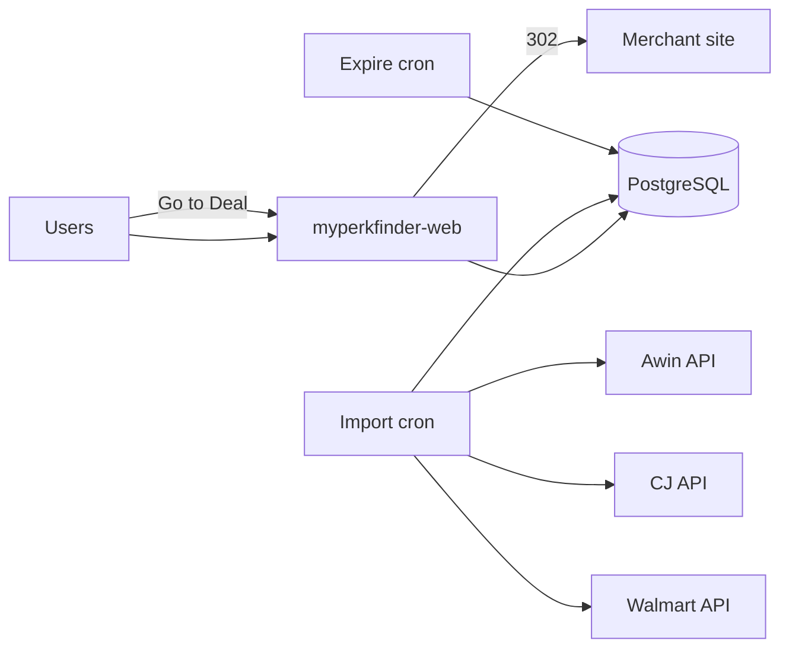

# MyPerkFinder

Scalable deal discovery platform — product offers, coupons, affiliate imports, and admin review.

**Production deployment:** [Railway](https://railway.com) (cost-optimized: one web service + cron workers + Postgres).

## Stack

| Concern    | Technology                                      |
| ---------- | ----------------------------------------------- |
| Monorepo   | Turborepo + pnpm workspaces                     |
| Web (prod) | Next.js 15 — public site, admin, API routes     |
| Database   | PostgreSQL + Prisma                             |
| Imports    | Railway cron workers (`@mpf/worker` CLI)        |
| Search     | PostgreSQL `ILIKE` (no Meilisearch in prod MVP) |

Legacy local apps (`apps/api` Fastify, `apps/admin`) are available for full-stack local use. **Railway production only deploys `apps/web` + workers.** Admin Fastify routes require `Authorization: Bearer $ADMIN_AUTH_SECRET`.

## Layout

```
apps/
  web/       ← Railway: myperkfinder-web (public + admin + /api/*)
  worker/    ← Railway cron CLIs (import + expire)
  api/       ← Local Fastify API (auth-gated admin; not Railway)
  admin/     ← Local Next admin UI (optional; web /admin is preferred)
packages/
  affiliate/ validators/ db/ types/ ui/ env/ config/
docs/deployment/
  railway-checklist.md
```

---

## Local development

### Prerequisites

- Node.js 24+ (see `engines` in root `package.json`)
- pnpm 11+ (see `packageManager` in root `package.json`)
- Docker (for local Postgres)

### Setup

```bash
pnpm install
cp .env.example .env
pnpm infra:up          # Postgres (+ optional Redis/Meili for legacy dev)
pnpm db:generate
pnpm db:migrate
pnpm db:seed           # optional sample data
pnpm dev               # Next.js web on :3000
```

| URL              | Description                          |
| ---------------- | ------------------------------------ |
| http://localhost:3000      | Public site                |
| http://localhost:3000/admin | Admin dashboard           |
| http://localhost:3000/api/health | Health check          |

### Commands

| Command | Description |
| ------- | ----------- |
| `pnpm dev` | Start web app |
| `pnpm dev:all` | Start web + local api/admin/worker via turbo |
| `pnpm test` | Unit tests (validators, category infer, safe redirect) |
| `pnpm build` / `pnpm build:web` | Production build |
| `pnpm start:web` | Migrate + start production web server |
| `pnpm db:migrate` | Dev migrations |
| `pnpm db:migrate:deploy` | Production migrations |
| `pnpm db:studio` | Prisma Studio |
| `pnpm worker:import` | Run all enabled sources (Awin/CJ/Walmart) once — **Railway import cron** |
| `pnpm worker:import-awin` | Run Awin only (local/debug) |
| `pnpm worker:import-cj` | Run CJ only (local/debug) |
| `pnpm worker:import-walmart` | Run Walmart only (local/debug) |
| `pnpm worker:expire-offers` | Mark expired offers |

### Cron workers locally

```bash
pnpm build:worker
pnpm worker:import         # combined: enabled sources only (or MOCK_EXTERNAL=true)
pnpm worker:import-awin    # single-source debug helpers
pnpm worker:import-cj
pnpm worker:import-walmart
pnpm worker:expire-offers
```

---

## Environment variables

Copy `.env.example` to `.env`. **Never** prefix secrets with `NEXT_PUBLIC_`.

| Variable | Required | Service | Description |
| -------- | -------- | ------- | ----------- |
| `DATABASE_URL` | Yes | web, workers | PostgreSQL connection string |
| `DIRECT_URL` | Yes | web, workers | Same as DATABASE_URL for Prisma |
| `NEXT_PUBLIC_SITE_URL` | Yes (prod web) | web | Public URL, e.g. `https://myperkfinder.com` — **set explicitly on Railway** |
| `ADMIN_AUTH_SECRET` | Yes (prod web) | web | Admin login secret (min 16 chars). Generate: `openssl rand -base64 32` |
| `AWIN_ACCESS_TOKEN` | Yes when `MOCK_EXTERNAL=false` | worker | Awin API bearer token — **server only** |
| `AWIN_PUBLISHER_ID` | Yes when `MOCK_EXTERNAL=false` | worker | Awin publisher ID — **server only** (default `2975213`) |
| `AWIN_MEMBERSHIP_FILTER` | No | worker | `all` (test) / `joined` (prod) / `notJoined` |
| `AWIN_REGION_CODES` | No | worker | Comma-separated, default `US` |
| `AWIN_PAGE_SIZE` | No | worker | Default `100` |
| `AWIN_MAX_PAGES` | No | worker | Default `50` (safety cap) |
| `AWIN_DEBUG_RAW_PAGES` | No | worker | Save full API page payloads to RawRecord |
| `CJ_ACCESS_TOKEN` | Yes when `MOCK_EXTERNAL=false` | worker | CJ personal access token — **server only** |
| `CJ_WEBSITE_ID` | Yes when `MOCK_EXTERNAL=false` | worker | CJ website/company ID — **server only** |
| `CJ_RELATIONSHIP_STATUS` | No | worker | Default `joined` |
| `CJ_PAGE_SIZE` | No | worker | Default `100` |
| `CJ_MAX_PAGES` | No | worker | Default `1` (first tests) |
| `CJ_DEBUG_RAW_PAGES` | No | worker | Save full CJ page payloads |
| `WALMART_API_KEY` | Yes when `MOCK_EXTERNAL=false` | worker | Walmart Affiliate API key — **server only** |
| `WALMART_PUBLISHER_ID` | Yes when `MOCK_EXTERNAL=false` | worker | Walmart publisher ID — **server only** |
| `WALMART_SEARCH_TERMS` | No | worker | Comma-separated queries (default `electronics,home`) |
| `WALMART_PAGE_SIZE` | No | worker | Default `25` (API max) |
| `WALMART_MAX_PAGES` | No | worker | Default `1` (first tests; try `2` next) |
| `WALMART_DEBUG_RAW_PAGES` | No | worker | Save full Walmart page payloads |
| `DEBUG_RAW_PAGES` | No | workers | Global raw-page debug for any source |
| `MOCK_EXTERNAL` | No | workers | `true` = mock source data (no credentials); **`false` in prod** |
| `REDIS_URL` | No | legacy worker | Only if running BullMQ locally |
| `RESEND_API_KEY` | No | — | Email (future) |
| `OPENAI_API_KEY` | No | — | LLM extraction (future) |
| `NEXT_SERVER_ACTIONS_ENCRYPTION_KEY` | Recommended (web) | web | Stable Server Action key across deploys. Generate: `openssl rand -base64 32` — set before **build** and at runtime |
| `PORT` | Auto | web | Set by Railway |

### Railway web service variables (required)

Set these on **myperkfinder-web** before deploy:

| Variable | How to set |
| -------- | ------------ |
| `DATABASE_URL` | Reference from Postgres plugin |
| `DIRECT_URL` | Same value as `DATABASE_URL` |
| `NEXT_PUBLIC_SITE_URL` | `https://your-app.up.railway.app` or custom domain (no trailing slash) |
| `ADMIN_AUTH_SECRET` | `openssl rand -base64 32` |

Optional:

| Variable | How to set |
| -------- | ------------ |
| `NEXT_SERVER_ACTIONS_ENCRYPTION_KEY` | `openssl rand -base64 32` — reduces post-deploy Server Action log noise |
| `NODE_ENV` | **Remove** if set to `development` — start script forces `production` |

### Admin authentication

Set `ADMIN_AUTH_SECRET` on **myperkfinder-web** in Railway (minimum 16 characters):

```bash
openssl rand -base64 32
```

- Visit `/admin/login` and enter the secret (stored in an httpOnly cookie).
- `/admin/*` and `/api/admin/*` are blocked by middleware without auth.
- API automation can use `Authorization: Bearer <ADMIN_AUTH_SECRET>`.
- In local development, admin routes are open if `ADMIN_AUTH_SECRET` is unset.

## Affiliate / retail source roadmap

| Source | Status | Adapter | Worker CLI | Railway |
| ------ | ------ | ------- | ---------- | ------- |
| **Awin** | Implemented | `sources/awin.ts` | `worker:import` (or `import-awin`) | shared import cron |
| **CJ Affiliate** | Implemented | `sources/cj.ts` | `worker:import` (or `import-cj`) | shared import cron |
| **Walmart** | Implemented | `sources/walmart.ts` | `worker:import` (or `import-walmart`) | shared import cron |
| Impact | Placeholder | `sources/impact.ts` | — | — |
| Rakuten | Placeholder | `sources/rakuten.ts` | — | — |
| eBay | Placeholder | `sources/ebay.ts` | — | — |
| Amazon | Not started | — | — | — |

All live sources share `apps/worker/src/jobs/run-source-import.ts`. Railway uses **two** cron services only:

| Worker | Config | Cron (UTC) | Command |
| ------ | ------ | ---------- | ------- |
| **Import** (Awin + CJ + Walmart) | `apps/worker/railway.import.json` | `0 */6 * * *` | `pnpm worker:import` |
| **Expire** | `apps/worker/railway.expire-offers.json` | `30 18 * * *` | `pnpm worker:expire-offers` |

Sources without credentials are **skipped** on the combined import (unless `MOCK_EXTERNAL=true`, which runs all with mock data).

**Testing order (every new source):**

1. `MOCK_EXTERNAL=true` (no credentials)
2. Real credentials with `*_MAX_PAGES=1`
3. Review `/admin/imports` + `/admin/review`
4. Raise max pages carefully
5. Enable Railway cron schedule

---

## Phase 3: Awin API Worker Setup

Awin credentials are **worker-only**. Never add `AWIN_ACCESS_TOKEN` to `apps/web` or prefix with `NEXT_PUBLIC_`.

### Get Awin API token

1. Log in to [Awin](https://ui.awin.com)
2. Top-right user menu → **API Credentials**
3. Enter password → **Show my API token**

**Publisher ID:** `2975213`

### Local test (mock — no token required)

```bash
cp .env.example .env
# Ensure MOCK_EXTERNAL=true
pnpm build:worker
pnpm worker:import-awin
```

Verify at `/admin/imports` and `/admin/review`.

### Local test (real Awin API)

```bash
MOCK_EXTERNAL=false
AWIN_ACCESS_TOKEN=your_token
AWIN_PUBLISHER_ID=2975213
AWIN_MEMBERSHIP_FILTER=all
AWIN_MAX_PAGES=1
pnpm build:worker && pnpm worker:import-awin
```

Use `AWIN_MEMBERSHIP_FILTER=all` for API testing. Use `joined` for production publishing once advertiser approvals are in place.

If real import returns zero offers, advertiser approvals may still be pending or no active promotions match your filters.

### Railway service: `myperkfinder-worker-import`

| Setting | Value |
| ------- | ----- |
| Root directory | `/` (repo root) |
| Config file | `apps/worker/railway.import.json` |
| Build command | `pnpm build:worker` |
| Start command | `pnpm worker:import` |
| Service type | **Cron Job** (not always-on) |
| Cron schedule | `0 */6 * * *` |

Put **all** source credentials on this one worker (`AWIN_*`, `CJ_*`, `WALMART_*`). Missing networks are skipped.

**First test variables:**

```
NODE_ENV=production
DATABASE_URL=${{Postgres.DATABASE_URL}}
DIRECT_URL=${{Postgres.DATABASE_URL}}
MOCK_EXTERNAL=true
```

**Real import variables (after mock test passes):**

```
NODE_ENV=production
DATABASE_URL=${{Postgres.DATABASE_URL}}
DIRECT_URL=${{Postgres.DATABASE_URL}}
MOCK_EXTERNAL=false
AWIN_ACCESS_TOKEN=your_token
AWIN_PUBLISHER_ID=2975213
AWIN_MEMBERSHIP_FILTER=joined
AWIN_REGION_CODES=US
AWIN_PAGE_SIZE=100
AWIN_MAX_PAGES=1
CJ_ACCESS_TOKEN=…
CJ_WEBSITE_ID=…
CJ_MAX_PAGES=1
WALMART_API_KEY=…
WALMART_PUBLISHER_ID=…
WALMART_MAX_PAGES=1
```

**Production publishing:** set `AWIN_MEMBERSHIP_FILTER=joined` and raise `*_MAX_PAGES` as needed.

See `apps/worker/.env.example` for all worker-only variables.

---

## CJ Affiliate Worker Setup

CJ credentials are **worker-only**. Never add `CJ_ACCESS_TOKEN` / `CJ_WEBSITE_ID` to `apps/web`.

### Get CJ credentials

1. Log in to [CJ Affiliate](https://members.cj.com)
2. Account → **Web Services** / API credentials → personal access token
3. Note your **Website ID** (PID / company id used by Link Search)

### Local / single-source CJ

Use `pnpm worker:import-cj` for debugging. Production uses the **combined** `pnpm worker:import` cron (same `CJ_*` vars on `myperkfinder-worker-import`).

### Local test (mock)

```bash
MOCK_EXTERNAL=true
pnpm build:worker
pnpm worker:import-cj
```

### Local test (real CJ Link Search)

```bash
MOCK_EXTERNAL=false
CJ_ACCESS_TOKEN=your_token
CJ_WEBSITE_ID=your_website_id
CJ_RELATIONSHIP_STATUS=joined
CJ_PAGE_SIZE=100
CJ_MAX_PAGES=1
pnpm build:worker && pnpm worker:import-cj
```

---

## Walmart Retail Worker Setup

Walmart credentials are **worker-only**. Never add `WALMART_API_KEY` to `apps/web`.

### Get Walmart Affiliate credentials

1. Apply / log in via [Walmart Affiliate](https://affiliates.walmart.com) (or legacy Impact/Walmart Labs keys if still active)
2. Copy API key + publisher ID for Product Search (`api.walmartlabs.com/v1/search`)

> Newer walmart.io signed APIs can be added later without changing `NormalizedOffer`.

### Local / single-source Walmart

Use `pnpm worker:import-walmart` for debugging. Production uses the **combined** `pnpm worker:import` cron (same `WALMART_*` vars on `myperkfinder-worker-import`).

### Local test (mock)

```bash
MOCK_EXTERNAL=true
pnpm build:worker
pnpm worker:import-walmart
```

### Local test (real Walmart search)

```bash
MOCK_EXTERNAL=false
WALMART_API_KEY=your_key
WALMART_PUBLISHER_ID=your_publisher_id
WALMART_SEARCH_TERMS=electronics,home
WALMART_PAGE_SIZE=25
WALMART_MAX_PAGES=1
pnpm build:worker && pnpm worker:import-walmart
```

---

## Railway deployment

**Important — monorepo root:** Keep **Root Directory** at the **repo root** (`/`) for every Railway service (web and cron workers). **Do not** set Root Directory to `apps/web` or `apps/worker`.

This repo uses root-level pnpm workspace scripts (`pnpm build:web`, `pnpm start:web`, etc.). Railway config files live under `apps/*` but are referenced by **Config file path** only — that path does not change the service root. See [Railway monorepo docs](https://docs.railway.com/guides/monorepo).

### 1. Create project

1. [Railway](https://railway.com) → **New Project** → **Deploy from GitHub** → select this repo.
2. Project name: `myperkfinder`.

### 2. Add PostgreSQL

- **Add plugin** → **PostgreSQL**.
- Copy `DATABASE_URL` to all services. Set `DIRECT_URL` = same value.

### 3. Service: `myperkfinder-web`

| Setting | Value |
| ------- | ----- |
| **Root directory** | `/` (repo root) — **not** `apps/web` |
| **Config file** | `apps/web/railway.json` |
| **Builder** | Railpack (uses root `package.json` `build` + `start` scripts) |
| **Build command** | `pnpm build:web` (Railpack runs `pnpm install` first) |
| **Start command** | `pnpm start:web` |
| **Optional env** | `RAILPACK_INSTALL_CMD=pnpm install --frozen-lockfile` |
| **Health check** | `/api/health` |

**Env vars:** `DATABASE_URL`, `DIRECT_URL`, `NEXT_PUBLIC_SITE_URL`, `ADMIN_AUTH_SECRET`

Set `NODE_ENV=production` at runtime (or omit it — Railway sets production). **Do not** set `NODE_ENV=development` on Railway; it breaks `next build`.

Run migrations once (Railway shell or one-off job):

```bash
pnpm db:migrate:deploy
```

### 4. Service: `myperkfinder-worker-import`

| Setting | Value |
| ------- | ----- |
| **Root directory** | `/` (repo root) — **not** `apps/worker` |
| **Config file** | `apps/worker/railway.import.json` |
| **Build command** | `pnpm build:worker` (from config file) |
| **Start command** | `pnpm worker:import` |
| **Cron schedule** | `0 */6 * * *` |

Create this as a **second service** from the same GitHub repo (not on the web service). Point **Config file** at `apps/worker/railway.import.json`. Railway applies `cronSchedule` from that file — do **not** put the schedule in Variables.

> Cron schedule is **not** an environment variable. Railway only reads it from Settings → Cron Schedule or from `deploy.cronSchedule` in the service config file. App vars like `AWIN_*` / `CJ_*` / `WALMART_*` stay in Variables.

**Env vars (this worker only):** `DATABASE_URL`, `DIRECT_URL`, `MOCK_EXTERNAL=false`, plus any of `AWIN_*` / `CJ_*` / `WALMART_*` you use. Sources without credentials are skipped.

If you already have an older Awin-only cron, update its **Config file** to `apps/worker/railway.import.json`, set start to `pnpm worker:import`, and add CJ/Walmart env vars to that service.

### 5. Service: `myperkfinder-worker-expire-offers`

| Setting | Value |
| ------- | ----- |
| **Root directory** | `/` (repo root) — **not** `apps/worker` |
| **Config file** | `apps/worker/railway.expire-offers.json` |
| **Start command** | `pnpm worker:expire-offers` |
| **Cron schedule** | `30 18 * * *` — 2:30 PM EDT (18:30 UTC) daily |

**Env vars:** `DATABASE_URL`, `DIRECT_URL`, `NODE_ENV=production`

### 6. What NOT to deploy (cost saving)

- `apps/api` (Fastify) — API lives in Next.js `/api/*`
- `apps/admin` — admin lives at `/admin/*` in web
- Always-on BullMQ worker — use cron CLIs instead
- Redis — not required for cron imports
- Meilisearch — Postgres search only

### 7. Custom domain

1. Railway web service → **Settings** → **Networking** → **Custom Domain** → `myperkfinder.com`
2. Add DNS CNAME per Railway instructions.
3. Update `NEXT_PUBLIC_SITE_URL=https://myperkfinder.com`

### 8. Logs & testing

```bash
# Health
curl https://myperkfinder.com/api/health

# Redirect (replace ID)
curl -sI "https://myperkfinder.com/api/r/OFFER_ID"
```

See [docs/deployment/railway-checklist.md](./docs/deployment/railway-checklist.md) for full pre-launch checklist.

---

## Architecture (Railway)



Affiliate APIs are called **only** from cron workers — never from the browser.

---

## Wireframes

Open `docs/wireframes/myperkfinder-wireframes.html` for the product design preview.
